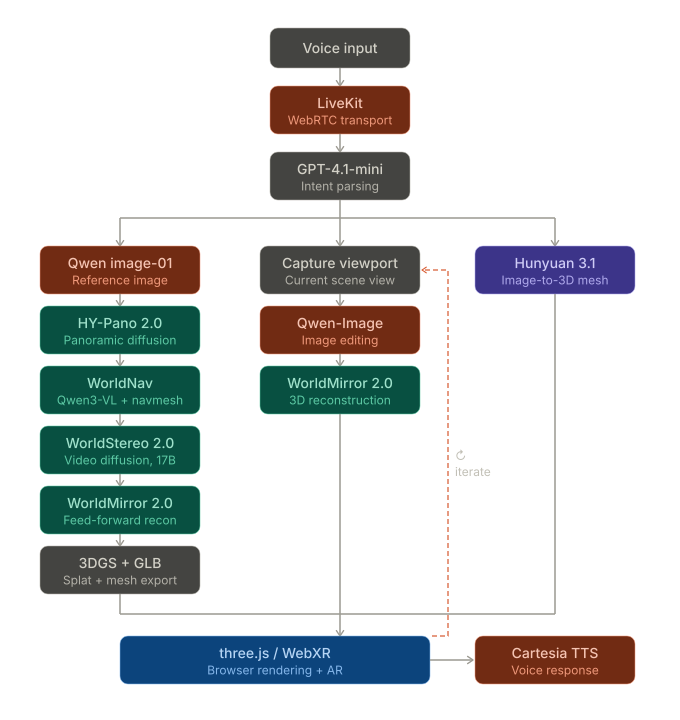

# Atlas

> Speak a world into existence, then redesign it with your voice.

Atlas generates full 3D environments from a spoken description and lets you
iterate on them in real time through conversation. Describe a scene, walk through
it in your browser, then keep talking to reshape it: add objects, change the
lighting, restyle surfaces, swap materials. No 3D software, no modeling skills —
just your voice and a world that listens.

## Architecture

Voice routes through LiveKit into an intent parser, which fans out to three
paths — **world generation**, **scene iteration**, and **object placement** —
all of which converge on a three.js renderer with a spoken response.

## How It Works

### World Generation — generative world models + Gaussian splatting

A spoken prompt is turned into a Qwen reference image, then lifted into a fully
navigable 3D world by **Tencent HY-World 2.0**, a generative *world model* rather
than a single-image generator. The pipeline is a cascade of diffusion and
neural-reconstruction stages:

- **HY-Pano 2.0** — panoramic latent diffusion synthesizes a seamless 360°
  equirectangular environment from the Qwen reference, fixing global scene
  structure, illumination, and style in one coherent shot.
- **WorldNav (Qwen3-VL + navmesh)** — a Qwen3-VL vision-language model reads the
  panorama, plans a camera trajectory through it, and builds a navmesh — sampling
  the viewpoints needed to recover parallax and occlusion cues.
- **WorldStereo 2.0** — multi-view stereo (17B) with monocular depth priors
  lifts the posed 2D views into metric 3D geometry.
- **WorldMirror 2.0** — a feed-forward neural reconstruction model fuses the
  posed views into a dense, geometrically consistent scene.
- **3DGS + GLB** — exported as a **3D Gaussian Splatting** radiance field for
  photoreal real-time rendering, alongside a watertight **GLB** mesh for
  collision, physics, and AR.

Unlike video-diffusion "world simulators" that hallucinate frames, this produces
*persistent, explorable geometry* — real 3D assets you can walk through. The
pipeline runs on cloud **A100** GPUs.

### 3D Iteration — Qwen image editing + neural re-reconstruction

To iterate we close a *perception → edit → reconstruction* loop. The current
viewport is captured; **Qwen-Image** applies the requested change (restyle,
recolor, add detail, shift atmosphere) as an instruction-guided edit; the edited
view is shown for approval, then re-projected through **WorldMirror 2.0** to
reconstruct updated 3D geometry in place. One voice command updates the scene
without regenerating the whole world.

### Object Generation — image-to-3D mesh

"Add a bench here" generates a Qwen reference image, then turns it into a 3D mesh
with **Hunyuan 3.1** (image-to-3D on Replicate), falling back to **Tripo3D** if
Hunyuan is unavailable. The resulting GLB drops into the live scene at the spot
you're looking at.

### Voice Interaction — LiveKit Inference

**LiveKit** provides low-latency WebRTC audio transport, and the agent
(`voice/agent.py`) routes STT, the routing LLM, and TTS through **LiveKit
Inference** — one bill, no extra provider keys. Streaming **Deepgram Nova-3**
transcribes speech; **GPT-4.1-mini** parses each utterance into exactly one typed
tool call (generate world, generate object, iterate, set lighting, …); and
**Cartesia Sonic-2** speaks the confirmation. The LLM only picks a tool and fills
its args — tools speak fixed short confirmations — so conversational latency
stays decoupled from heavy GPU work.

### Rendering and AR — three.js + WebXR

The world loads in the browser via **three.js** (WebGL2). First-person
navigation lets you walk the environment on desktop; on WebXR-capable mobile, the
generated world anchors into your physical space as **AR**. Objects generated
mid-session drop into the live scene as GLB meshes.

## Tech Stack

- **Image Generation:** Qwen-Image — world reference images, object
  reference images, and iteration edits (Gemini / MiniMax as fallbacks)
- **World Generation:** HY-World 2.0 — HY-Pano 2.0, WorldNav (Qwen3-VL + navmesh),
  WorldStereo 2.0, WorldMirror 2.0 → 3D Gaussian Splatting + GLB
- **3D Iteration:** Qwen-Image (instruction-guided editing) + WorldMirror 2.0
  (neural 3D reconstruction from edited views)
- **Object Generation:** Hunyuan 3.1 (image-to-3D), Tripo3D fallback
- **Voice:** LiveKit (WebRTC) + LiveKit Inference — Deepgram Nova-3 (STT),
  GPT-4.1-mini (intent / tool-routing), Cartesia Sonic-2 (TTS)
- **Rendering:** three.js (WebGL2), WebXR
- **Infrastructure:** RunPod (A100 GPUs)

## Hackathon Tracks

- **Co-Pilot** — an ambient agent that takes voice input and displays live 3D context
- **Support** — voice-guided world building with real-time visual feedback

## Team

- Samantha Jeanneb
- Yehor Ivanenko

## Built At

Conversational AI Hackathon, hosted by Moss (F25) at Y Combinator — June 6–7, 2026
